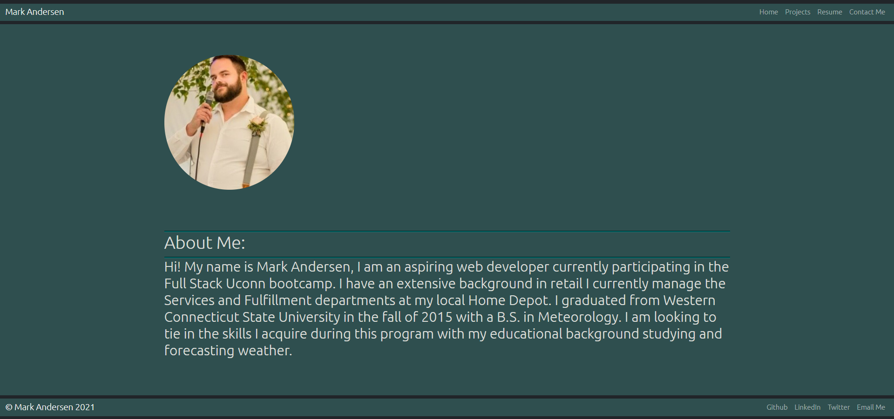
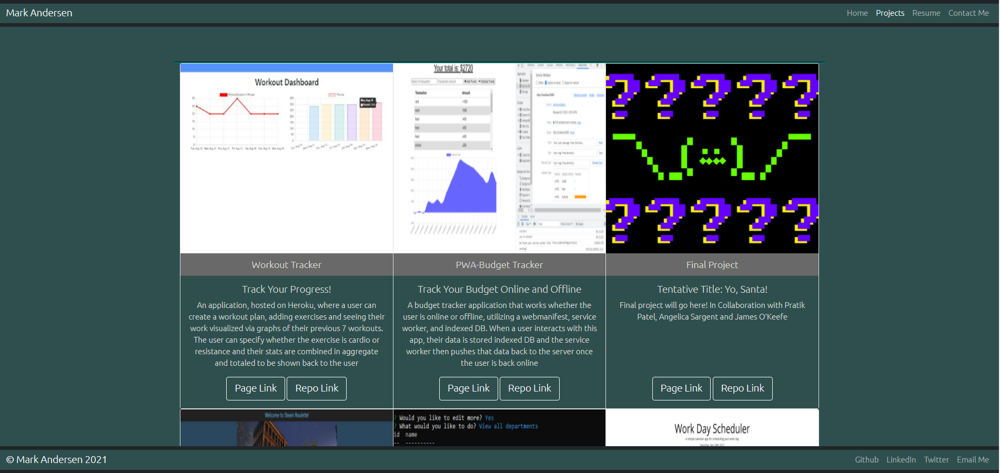
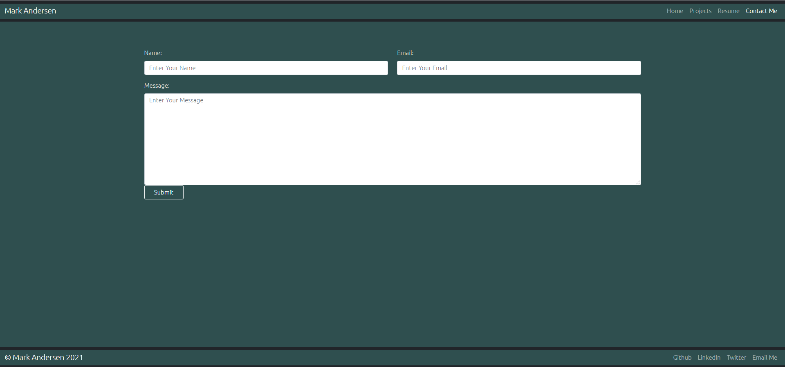

# Portfolio-In-React

## Description:
The purpose of this excercise was to create a new single page porfolio utilizing React. I used React and the React-Bootstrap package/library to style, as well as added a custom CSS folder for base style for the entire page. This portfolio shows of 5 of my best works as well as a 6th slot for the upcoming final project. This page has persistent components such as Navbar to navigate to the separate rendered pages, and a Footer that has links to my Github, LinkedIn and Twitter accounts as well as a link to a downloadable version of my Resume. The "contact me" section is currently just for show, as there is no back end of this application to actually transmit any of the information to me, however I have added a 'mailto' link to my email on the footer of the page.

## Technologies Utilized:
- React
- React-Bootstrap
- Javascript
- CSS
- JSX

## Examples:

### Home Page

### Projects

### Proficiencies

### Contact Form Field

## Challenges & Thoughts:
- React was a bit confusing to get a hang of at first but is actually rather straight forward. Using State to manage conditional rendering seems extremely useful and efficient as well as having a single page to display whatever is needed. I enjoyed learning React-Bootstrap and it's syntax seemed very straight forward with good documentation. Mixing and matching custom CSS with the Bootstrap library at times was a little frustrating.

## Questions/Links:
https://github.com/MarkAndersen
 
https://markandersen.github.io/Portfolio-In-React/
 
[Email me](mailto:Mark.Andersen75@gmail.com)
